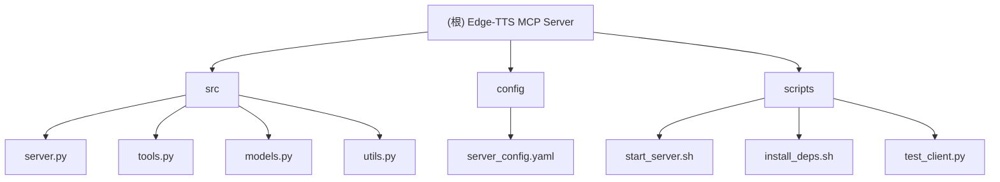

# Edge-TTS MCP Server 项目文档

[根目录](./)

## 项目愿景

基于 Microsoft Edge TTS 服务的 MCP (Model Context Protocol) 服务器，提供高质量的文本转语音功能，支持多种语言和语音，为 AI 助手提供语音合成能力。

## 架构总览



## 模块索引

| 模块路径 | 职责描述 | 状态 |
|---------|---------|------|
| [src](./src/) | 核心代码模块，包含服务器、工具、模型和工具函数 | ✅ 已扫描 |
| [config](./config/) | 服务器配置模块 | ✅ 已扫描 |
| [scripts](./scripts/) | 脚本工具模块，包含启动和测试脚本 | ✅ 已扫描 |

## 运行与开发

### 安装依赖
```bash
pip install -r requirements.txt
# 或使用脚本
./scripts/install_deps.sh
```

### 启动服务器
```bash
python main.py
# 或使用脚本
./scripts/start_server.sh
```

### 测试服务器
```bash
python test_server.py
# 或使用客户端测试
python scripts/test_client.py
```

## 测试策略

- **单元测试**: 通过 `test_server.py` 测试核心功能
- **集成测试**: 通过 `scripts/test_client.py` 测试 HTTP API
- **功能测试**: 验证所有 MCP 工具的正确性

## 编码规范

- 使用 Python 3.7+ 语法
- 遵循 PEP 8 代码风格
- 使用类型注解 (Type Hints)
- 使用 Pydantic 进行数据验证
- 使用异步编程 (asyncio)

## AI 使用指引

### 适合 AI 协助的任务
- 添加新的语音处理功能
- 优化错误处理和日志记录
- 扩展配置选项
- 性能优化和缓存策略

### 需要人工审查的任务
- 核心音频处理逻辑
- 安全相关的配置
- 外部 API 集成

## 变更记录 (Changelog)

### 2025-09-03
- 添加多语音合成功能
  - 支持批量文本转语音
  - 支持数组形式输入多个语音配置
  - 每个语音段可独立配置参数
  - 最终合成一个音频文件

### 2025-09-03
- 初始化项目文档架构
- 创建根级 CLAUDE.md
- 创建模块级文档
- 添加 Mermaid 结构图
- 添加导航面包屑

---

*本文档由 Claude Code 自动生成，最后更新于 2025-09-03*